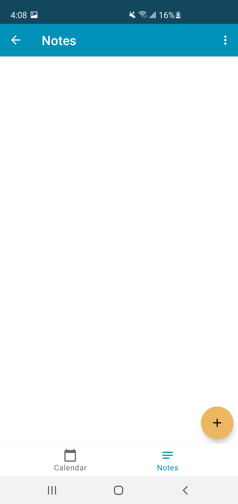

# KiDsTracker
KiDsTracker is an android application that will allow users to enlist their children with
disabilities to keep track of their health/medication with their providers.

  

This application includes:
- Login to keep a parents information secured:heavy_check_mark:
- Option to register a new account or secure a forgotten account:heavy_check_mark:
- Option to add more than one child:heavy_check_mark:
- Option to view a childs detailed information:heavy_check_mark:
- Option to add more than one provider:heavy_check_mark:
- Track a providers contact information/location:heavy_check_mark:
- A list of important questions based on a child with disabilities:heavy_check_mark:

## Motivation
The purpose of this application is to demonstrate my android development skills.
This application consists of libraries and best practices such as:
  1. MVVM architecture:heavy_check_mark:
  2. Room (local database):heavy_check_mark:
  3. Android Jetpack (SharedPreferences, WorkerkManager):heavy_check_mark:
  
## :camera:Screenshots:camera:

When logging in the application for the first time, users will be asked to create
an account

  
  

Once a user logs into the app for the first time, users will be shown a prompt to 
add a child to track 

  
  

Users will have the option to keep track of important information by adding notes 
and keep track of important dates by adding to the calendar

  
  

Users will also have the option to add providers of their child

  

Users will also have the option to log out of the app from the settings screen

  

## Framework
**Built with**
- [Room](https://developer.android.com/training/data-storage/room)
- [Android Jetpack](https://developer.android.com/jetpack)

## Information Reference
- [Valley Children's Healthcare](https://www.valleychildrens.org/):computer:

## License
    Copyright 2021 Daniel Toriz Valdovinos
